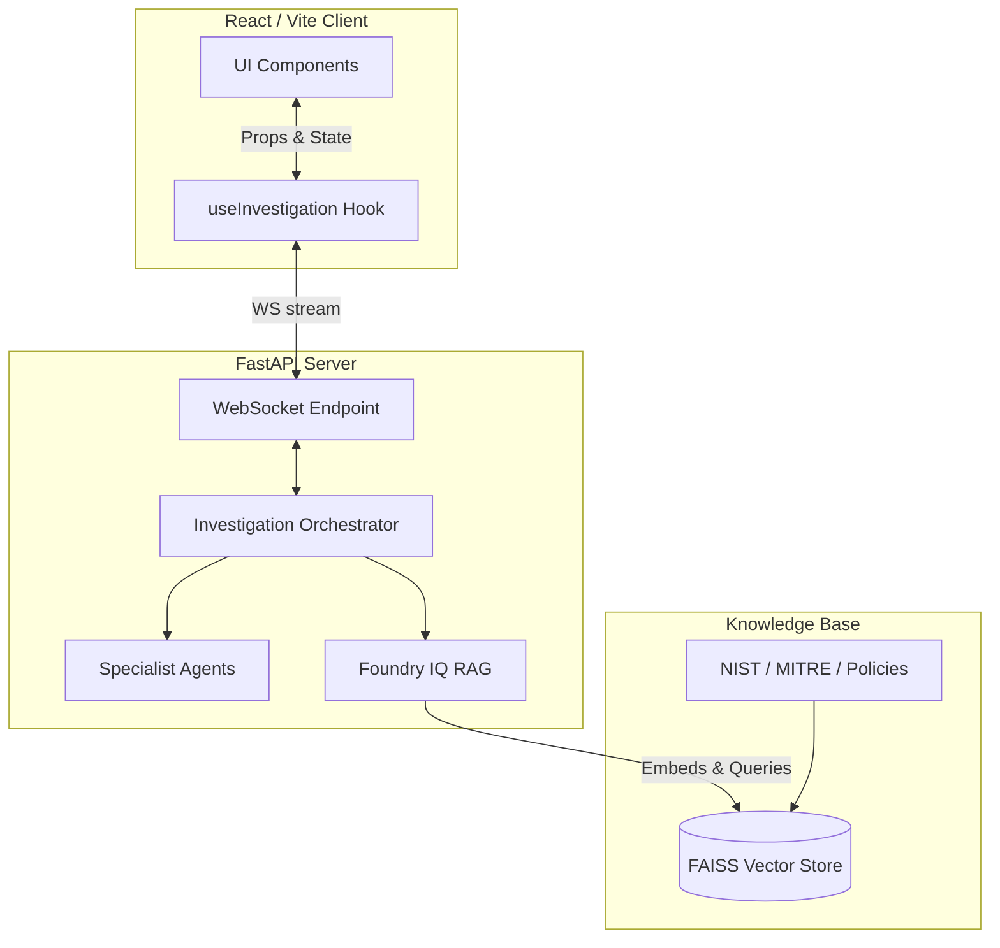

# SentinelIQ Architecture

## High-Level System Design

## Core Components
- **Frontend**: React 18, TailwindCSS v3 (Custom SOC Dark Theme).
- **Backend**: FastAPI for robust WebSocket streaming and Orchestrator logic.
- **RAG Engine**: `sentence-transformers` (`all-MiniLM-L6-v2`) and `faiss-cpu` for real-time semantic evidence grounding.
