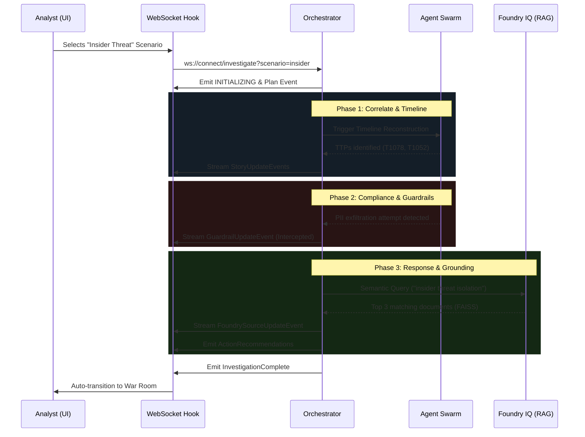

# SentinelIQ Investigation Workflow

```mermaid
sequenceDiagram
    participant Analyst as Analyst (UI)
    participant WS as WebSocket Hook
    participant Orch as Orchestrator
    participant Agents as Agent Swarm
    participant Foundry as Foundry IQ (RAG)

    Analyst->>WS: Selects "Insider Threat" Scenario
    WS->>Orch: ws://connect/investigate?scenario=insider
    
    Orch->>WS: Emit INITIALIZING & Plan Event
    
    rect rgb(20, 30, 40)
        Note over Orch,Agents: Phase 1: Correlate & Timeline
        Orch->>Agents: Trigger Timeline Reconstruction
        Agents-->>Orch: TTPs identified (T1078, T1052)
        Orch->>WS: Stream StoryUpdateEvents
    end
    
    rect rgb(40, 20, 20)
        Note over Orch,Agents: Phase 2: Compliance & Guardrails
        Agents-->>Orch: PII exfiltration attempt detected
        Orch->>WS: Stream GuardrailUpdateEvent (Intercepted)
    end
    
    rect rgb(20, 40, 20)
        Note over Orch,Foundry: Phase 3: Response & Grounding
        Orch->>Foundry: Semantic Query ("insider threat isolation")
        Foundry-->>Orch: Top 3 matching documents (FAISS)
        Orch->>WS: Stream FoundrySourceUpdateEvent
        Orch->>WS: Emit ActionRecommendations
    end
    
    Orch->>WS: Emit InvestigationComplete
    WS->>Analyst: Auto-transition to War Room
```
